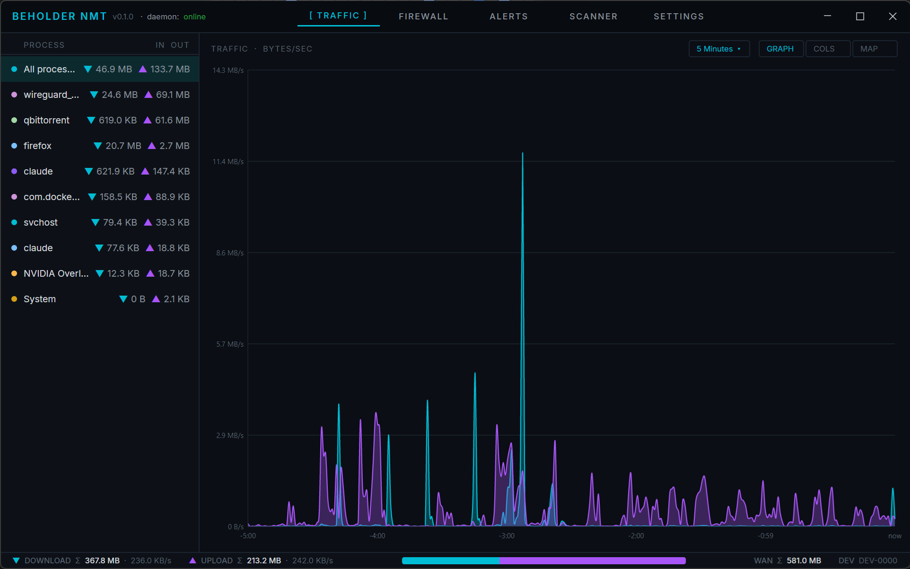
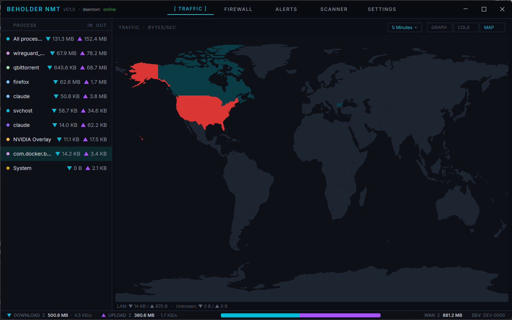
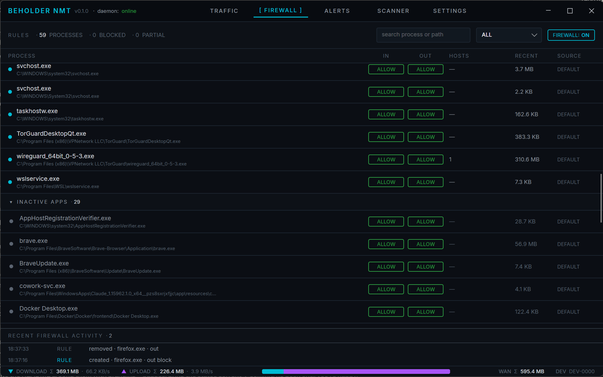
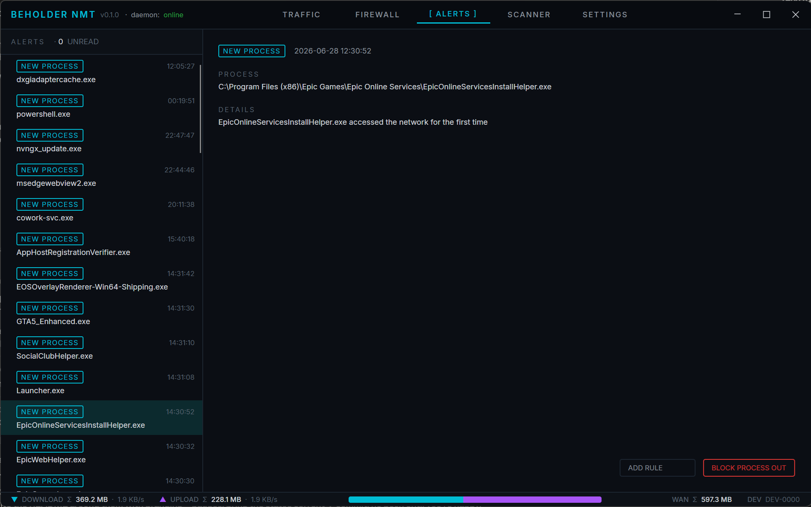

<div align="center">


# Beholder NMT

### See everything your machine says to the network — and make it answer to you.

[](LICENSE)


</div>

---

Beholder is an open-source **network monitor and application firewall** for Windows. It shows you every connection your apps make — *who, how much, and where on Earth it's going* — lets you block anything you don't trust with a single click, and keeps a tamper-proof, cryptographically signed record of all of it.

**No account. No cloud. No subscription.** The all-seeing eye works for you, and only you.

> You've seen monitors like this — the live traffic graph, the per-app firewall, the glowing world map, the *"a new app just connected"* alerts. Beholder gives you all of it, then strips away everything you never asked for: the sign-up, the cloud sync, the renewal notice, and the closed-source black box you're simply told to trust.



---

## Why Beholder

- 🔒 **Local-only, always.** No account, no telemetry, no cloud. The daemon never opens an inbound port and never phones home — your traffic history lives on your disk and nowhere else.
- 🆓 **Free and open source.** AGPL-3.0. Every feature, for everyone. No "Pro" tier, no paywall, no nag screens.
- 🧾 **Provable, not just visible.** Every firewall change, every new process, every alert is written to a SHA-256 hash chain sealed with Ed25519 signed checkpoints. Export a self-verifying record anyone can check with stock crypto — proof of what your machine did that *even Beholder can't forge*.
- 👁️ **It catches what others wave through.** Logical-app-identity spoof detection flags a binary wearing a trusted app's name but signed by a *different* publisher — a class of impersonation most monitors never notice.
- ⚡ **Built for the machine, not the marketing.** Per-process capture rides native Windows ETW; firewall enforcement uses the Windows Filtering Platform. No kernel driver. No third-party agent. No magic.

---

## What it does

### 👁 See every connection

Every app, ranked by what it's actually moving — bytes in, bytes out, live and historical. A stitched five-tier rollup serves **1-second fidelity on recent traffic and progressively coarser history** from a single query, so you can scrub from the last 5 minutes to the last 30 days without missing the spike that mattered. Pick any process to isolate it; watch the whole machine at a glance.

*(Traffic tab, above — the live `bytes/sec` graph with per-process breakdown.)*

### 🌍 Watch the world



Flip the Traffic tab to **MAP** and your connections light up the globe. Country-level GeoIP (offline — the database ships in the box, nothing is queried over the network) paints a heatmap of where your bytes go; hover any country for its **top-3 destinations by volume**. Local-network and un-located traffic are pulled out into their own strip, so the map shows the truth instead of a smear.

### 🛡 Block what you don't trust



A real application firewall with **three-state ALLOW / BLOCK / DEFAULT** control per direction, per app. One master switch arms or disarms every rule without losing your configuration. Active and inactive apps are grouped, orphaned rules for uninstalled programs are flagged, and a live activity strip shows exactly what just changed.

### 🚨 Catch the impostor



Beholder tells you the moment something new touches the network — and it's smart about it. Alerts are deduplicated by **logical app identity** (publisher + product + signature), so auto-updaters that rename themselves every release stay quiet, while a binary that suddenly carries a *different* signing publisher under a familiar name fires a **spoof alert**. Click the OS toast to jump straight to it, then block it out without leaving the screen.

### 🧾 Prove what happened

The audit log isn't just a list — it's a **SHA-256 hash chain**. Every state-changing event links to the last, periodic **Ed25519 signed checkpoints** seal the head, and verification anchors on the latest checkpoint to catch even a *cascaded rewrite* that a naïve hash walk would accept. One click exports a **signed, self-verifying JSON record** any third party can validate with off-the-shelf crypto — no Beholder install required.

### 📡 Map your own turf

The Scanner discovers the devices on your LAN (ARP + mDNS/DNS-SD + NetBIOS + router-DNS hostname resolution), names them by vendor, and lets you label the ones that matter — so "unknown device at 192.168.1.42" becomes "kid's tablet."

---

## Get it

Beholder ships as a **single self-contained installer** — it bundles the .NET runtime, so there's nothing else to install.

```powershell
# Build the installer (Windows; restores the WiX tool on first run)
pwsh ./build-installer.ps1
# -> Beholder.Installer/bin/Release/BeholderNMT-0.1.0-win-x64.msi  (~93 MB)
```

Pre-built `.msi` downloads will land on the [Releases](https://github.com/Vane65855/Beholder/releases) page. Double-click, follow the wizard, and you're watching — the daemon installs as an auto-start background service and the UI lives in your system tray.

> **Two heads-ups while we're pre-release:** the installer is currently **unsigned**, so Windows SmartScreen will warn you (*More info → Run anyway*). And on first install, **sign out and back in** afterward — that adds your account to the local `beholder-users` group that's permitted to talk to the monitoring service.

---

## How it works

Beholder is two pieces, by design:

- **The daemon** runs as an elevated Windows service. It does all the watching — per-process capture over ETW, firewall enforcement over WFP, offline GeoIP, the detector pipeline, and the audit chain. It is the only component that touches the network.
- **The UI** is a lightweight [Avalonia](https://avaloniaui.net) desktop app running as your normal user. It draws the pictures and nothing more.

They talk over a **local named pipe locked down by an access-control list** — no TCP port, nothing listening for the outside world, nothing leaving the machine. (An optional outbound uplink to a self-hosted aggregator exists for fleet monitoring; it is **off by default**.)

---

## Build from source

**Prerequisites:** [.NET 10 SDK](https://dotnet.microsoft.com/download/dotnet/10.0), Windows 10 1809+ , Git.

```bash
git clone https://github.com/Vane65855/Beholder.git
cd Beholder
dotnet build

# Run in dev (daemon needs an elevated terminal):
dotnet run --project Beholder.Daemon     # terminal 1 (Administrator)
dotnet run --project Beholder.Ui         # terminal 2
```

Tests run on [Microsoft.Testing.Platform](https://learn.microsoft.com/dotnet/core/testing/microsoft-testing-platform-intro): build the solution, then run `Beholder.Tests.exe` directly. Architecture, coding standards, and the full phase history live in [`docs/`](docs/) — see [`ARCHITECTURE.md`](docs/ARCHITECTURE.md) and the [decision records](docs/decisions/).

**Status:** pre-release and actively developed — all core surfaces (Traffic, Map, Firewall, Alerts, Scanner, Settings) are working end-to-end, with a self-contained MSI installer and a 1496-test suite. The full roadmap is in [`docs/phases.md`](docs/phases.md).

---

## Privacy & trust

Beholder is the network monitor you don't have to take on faith. It's **AGPL-3.0 open source**, so you (or anyone) can read exactly what it does. It is **local-first** — no account, no cloud dependency, no analytics. And its audit trail is **cryptographically signed**, so the record of what your machine did can be independently verified and can't be quietly rewritten — not by an attacker, and not by Beholder.

---

## Roadmap

- **Linux** — a `netlink` + `nftables` daemon and a Linux UI port (project scaffolding exists; Windows is the primary platform today).
- **Optional fleet uplink** — outbound, TLS, off by default, for monitoring more than one machine.

---

## License

Copyright © 2026 Vane65855. Licensed under the **GNU Affero General Public License v3.0 or later** ([AGPL-3.0-or-later](LICENSE)) — use it, modify it, share it; if you run a modified version as a network service, share your changes under the same terms.

### Third-party attributions

- IP geolocation by [DB-IP](https://db-ip.com) — [CC BY 4.0](https://creativecommons.org/licenses/by/4.0/)
- Windows toast notifications via [Microsoft.Toolkit.Uwp.Notifications](https://github.com/CommunityToolkit/WindowsCommunityToolkit) — MIT
- World map geometry from [Natural Earth](https://www.naturalearthdata.com) (110m, public domain)
